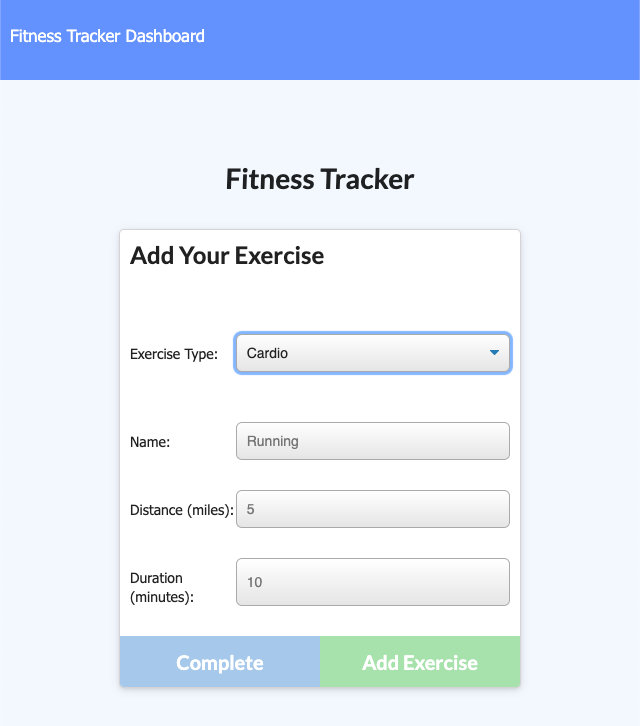

# Workout Tracker

## Description
This app allows users to view, create, and track workouts, each containing a subset log of multiple exercises on any given day.

Workout data is maintained in a Mongo database (with a Mongoose schema and Express routing). Each exercise logged within a workout tracks the name, type, weight, sets, reps, and duration. If the exercise is cardio, distance traveled is also tracked.

Users are able to:

* Add exercises to a previous workout plan.
* Add new exercises to a new workout plan.
* View the combined weight of multiple exercises on the `stats` page.

## Table of Contents
* [Installation](#installation)
* [Usage](#usage)
* [License](#license)
* [Contributing](#contributing)
* [Questions](#questions)

## Installation
[Workout Tracker App Link](https://cs-workout-tracker.herokuapp.com/)

## Usage

## License
This application is covered under the **MIT** license. A short and simple permissive license with conditions only requiring preservation of copyright and license notices. Licensed works, modifications, and larger works may be distributed under different terms and without source code.

## Contributing
Please refer to the [Contributor Covenant](https://www.contributor-covenant.org/version/2/0/code_of_conduct/).

## Questions
Please direct any questions regarding this application to the developer @[HumbleKind](https://github.com/HumbleKind) (GitHub), or via email at christian_sinai@me.com.
